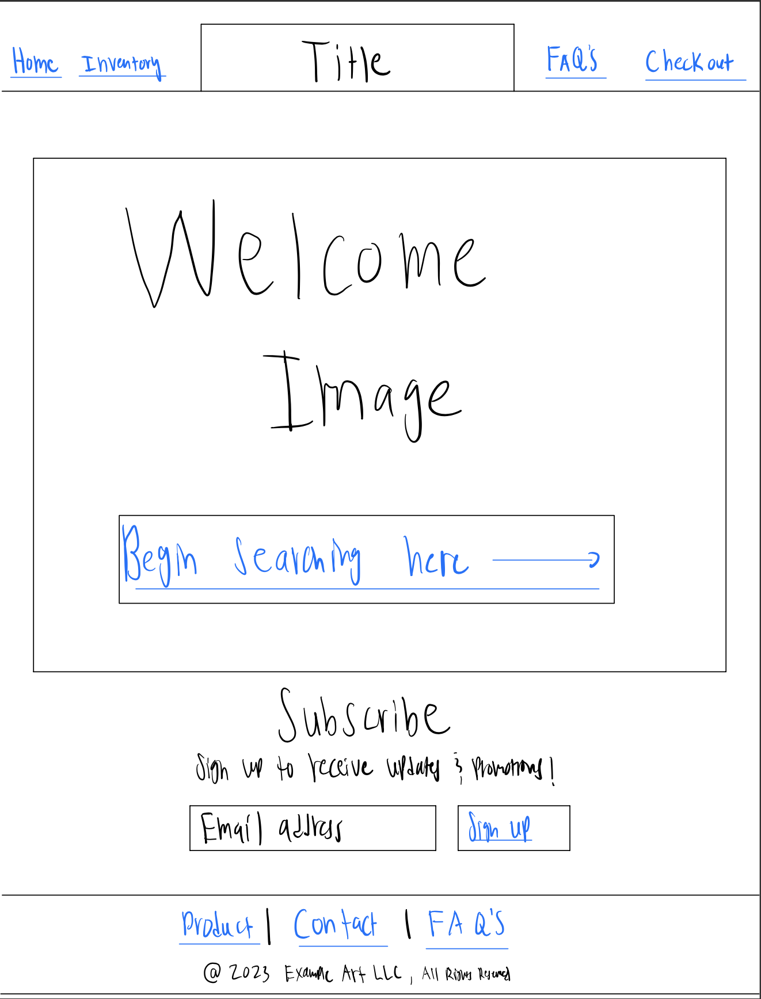

# startup

# Elevator Pitch
Imagine a world where startups effortlessly conquer the global market! My cutting-edge sales web application is the ultimate game-changer, empowering startups to effortlessly streamline their sales and marketing efforts. With intuitive customer profiles, real-time marketing updates, and seamless mobile transactions, this web application will revolutionize how businesses connect with their audience. Join me in reshaping the future of commerce, one click at a time.

# Design

# Key Features
- Secure login over HTTPS
- Home page
- Inventory selection page
- Checkout page
- Frequently asked questions page
- Subscription/profile sign up
- Navigation bar
- Shopping cart items stored in database
- Pricing and sold items displayed in real time
- Social media hyperlink

# Technologies
- HTML - Uses correct HTML structure for application. There will be 4 pages; a home page, an inventory page, a FAQ's page, and a checkout page.
- CSS - Application styling that is responsive, uses good whitespace, color choice, and contrast.
- JavaScript - Provides login, product display, shopping cart display, and backend endpoint calls.
- Service - Backend service with endpoints for:
   - Login authentication
   - Storing inventory items customers added to shopping cart
   - Submitting orders
   - Sending invoice emails to customer and business owner
- Database Data - Store customer accounts and shopping cart items in database.
- Login - Register and login users. Credentials securely stored in database. Can't purchase items from inventory unless authenticated.
- WebSocket Data - If an item is sold, it is marked as sold for all other users to see.
- React - Application ported to use the React web framework.

# HTML Deliverable
This deliverable represents the structural framework of my application using HTML.

- HTML pages - 4 HTML page that represent the ability to login and purchase art pieces.
- Links - Each page consists of a header and footer. These provide consistent information and links to each unique page.
- Text - Each page contains information about the products, pricing, and policies.
- Images - There are 3 sample images in a grid within the inventory section.
- Login - Input box and submit button for login. Also contains a customer checkout page with an area for them to enter info and submit an order.
- Database - The shopping cart items and customer accounts represent data pulled from the database.
- WebSocket - Counting items in shopping cart and marking them as sold represents realtime communication.
- Git commits with meaningful comments - Bug fix, Page updates and creation, Creation of pages, Description and grammar corrections.

# CSS Deliverable
For this deliverable I created the main styling format used throughout the website, and customized the various HTML pages.
- Header, footer, and main content body customized.
- Navigation elements - You can click on each of the navigation elements and it will take you to the indicated page. Also created hover CSS so buttons looks more responsive and appealing to the eye. I also created a navigation bar that can be seen when the application is shrunk down. It doesn't work yet given that I need to do some JS coding for it. 
- Responsive to window resizing - My app looks great on all window sizes and devices. I went through and customized each page individually.
- Application elements - Used good contrast, whitespace, padding, flex, and appropriate media queries for responsiveness.
- Application text content - Consistent fonts and color styling.
- Application images - Added welcome image and created inventory grid.

# JavaScript Deliverable
For this deliverable I implemented JavaScript so that the application works for a single user. I also added placeholders for future technology as required for this section.
- Login - Created a custom welcome drop down. When you enter your email and press Sign Up you are redirected to the contact.html page in which you fill out a form to create a profile.
- Database - Displayed name after filling out contact form in the top right corner of contact.html. Also displays items that are selected by user using "Add to Cart" in top right corner. This funcionality creates a cart and also offers the option to clear the cart. (More functionality and styling will come later.) Currently user name, email, and items selected are stored and retrieved from local storage, but it will be replaced with the database data later.
- WebSocket - Within the shopping cart I used the a stack data strucuture to add and store items in an array for the creation of an order. The data stored within inventory will be retrieved by the checkout page. This will be replaced with WebSocket numbers later.
- Application logic - The application starts by welcoming you and asking for an email address to begin. After entering and submitting one, you are sent to the contact.html to fill out the form for a profile. (Your profile will be stored in a data base.) There are 3 required fields, which, if not filled out provide instructions of what is needed for you to continue. Once a profile is created, you will then be able to add items to a cart which will be stored in a data base. This data can then be retrieved and uploaded into the checkout page. Once the checkout info is filled out, the order can be submitted and the items in the inventory will be marked as sold.

# Service Deliverable
For this deliverable I added backend endpoints that retrieve inventory items, add items to a cart, retrieves submitted orders, clears cart of an order, and submits orders. I also improved the login and workflow of the website. After entering your email, you will be taken to the contact page to fill out your information. Once you fill it out, you can click on the inventory page to make your new order. Your name will now appear, and it will be connected to an order that you submit. 
- Create an HTTP service using Node.js and Express - done!
- Frontend served up using express static middleware - done!
- Calls to third party endpoints - I accessed the quotable API that generates random quotes. These are displayed on the home page below the welcome message header.
- Frontend calls service endpoints - I did this using the fetch function. I also used the Get method which serves static files, specifically index.html, from the public directory.
- Backend service endpoints - I've included the service end points, paths, methods, and purposes below: 
  
   - Get Selected Items Endpoint:
     - Path: /api/selectedItems
     - Method: GET
     - Purpose: Retrieves the selected items from local storage.
   
   - Add to Cart Endpoint:
     - Path: /api/addToCart
     - Method: POST
     - Purpose: Adds items to the cart. Expects JSON payload with itemName and itemPrice. Saves the updated cart in local storage.
   
   - Clear Cart Endpoint:
     - Path: /api/clearCart
     - Method: POST
     - Purpose: Clears the cart. Removes selected items from local storage.
   
   - Submit Order Endpoint:
     - Path: /api/submitOrder
     - Method: POST
     - Purpose: Submits an order. Expects JSON payload with userName and items. Saves the order in local storage, clears the cart, and sends a success response.
   
   - Get Orders Endpoint:
     - Path: /api/getOrders
     - Method: GET
     - Purpose: Retrieves all submitted orders from local storage.
    
# DB Deliverable
For this deliverable I stored submitted orders in the MongoDB rather than the local storage. I also modified my endpoints to add and get orders in a more simplifed and efficient way to meet the criteria for the assignement. 
- MongoDB Atlas database created - done!
- Endpoints for data - My endpoints for manipulating application data now process the data and send it to MongoDB. The data that is passed to mongo for an order is the user name, items submitted in the order, price of the item, and a timestamp of when the order occured. 
- Stores data in MongoDB - done!

# Login Deliverable
For this deliverable the logged in user is connected with the orders they submit. I have updated the application so that the user must login before being able to navigate the nav links in the header of the website (Navlinks are restricted until user logs in: Home, Inventory, FAQ, and Checkout). After logging in, the user can press 'order', this will take them to the inventory page. All the navlinks will be unlocked as well! Aside from the new UI features, the backend also now stores user credentials and orders on MongoDB. 

Each user must create a unique user name (email for now). The user will not be able to proceed in making an account if credentials have already been used. I've also incorporated authentification and security. The user passwords will be stored as an encryption to prevent security breaches. This was done by implementing secure cookie to store the authorization token for an authenticated user, and a secureApiRouter that wraps the existing router to add a middleware function that verifies that the authorization cookie is valid before passing the request to endpoints that require authorization.
- New user registration - Creates a new account in the database.
- Existing user authentication - Stores the order under the same user if the user already exists.
- Stores and retrieves credentials in MongoDB - Stores both user and their orders.
- Restricts application functionality based upon authentication - Navlinks in the header cannot be accessed until you've logged in. This is restricted on the frontend.

# Websocket Deliverable
For this deliverable I used webSocket to update the votes on the frontend in realtime.

- Backend listens for WebSocket connection - done!
- Frontend makes WebSocket connection - done!
- Data sent over WebSocket connection - done!
- WebSocket data displayed - All user votes display in realtime. I'm really proud that this is working. Way cool!
  
[Link: notes.md](notes.md)
